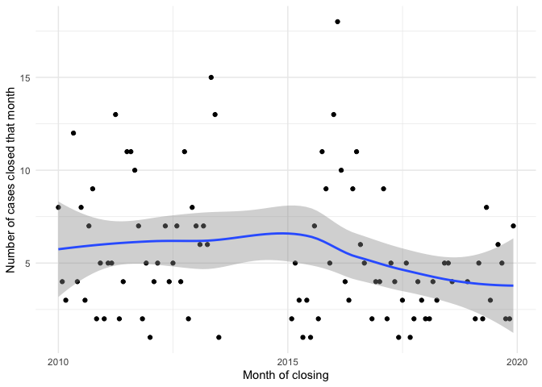
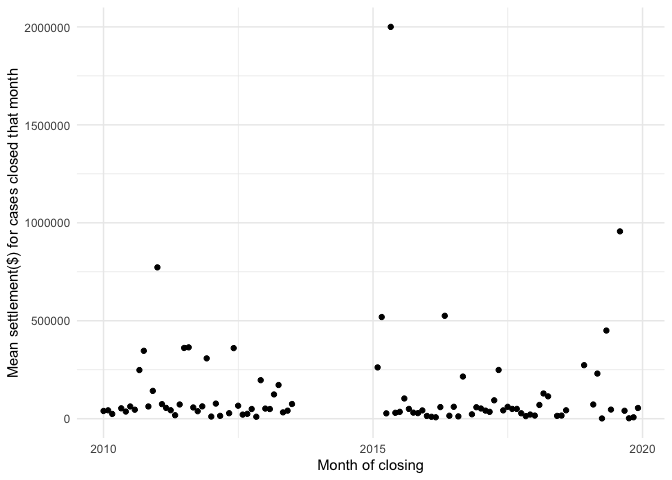

Marshall Project Exercise
================
Nick Thieme
3/27/2022

This markdown file contains the light EDA and story-finding associated
with Nick Thieme’s application to the Marshall Project as a data
journalist.

### Library

``` r
library(tidyverse)
```

    ## Warning: replacing previous import 'lifecycle::last_warnings' by
    ## 'rlang::last_warnings' when loading 'pillar'

    ## Warning: replacing previous import 'lifecycle::last_warnings' by
    ## 'rlang::last_warnings' when loading 'tibble'

    ## Warning: replacing previous import 'lifecycle::last_warnings' by
    ## 'rlang::last_warnings' when loading 'hms'

    ## ── Attaching packages ─────────────────────────────────────── tidyverse 1.3.1 ──

    ## ✓ ggplot2 3.3.5     ✓ purrr   0.3.4
    ## ✓ tibble  3.1.2     ✓ dplyr   1.0.7
    ## ✓ tidyr   1.1.3     ✓ stringr 1.4.0
    ## ✓ readr   1.4.0     ✓ forcats 0.5.1

    ## ── Conflicts ────────────────────────────────────────── tidyverse_conflicts() ──
    ## x dplyr::filter() masks stats::filter()
    ## x dplyr::lag()    masks stats::lag()

``` r
library(lubridate)
```

    ## 
    ## Attaching package: 'lubridate'

    ## The following objects are masked from 'package:base':
    ## 
    ##     date, intersect, setdiff, union

``` r
D_settle <- read_csv("~/Desktop/detroit_edited.csv")%>% mutate(closed_month = str_c(str_sub(closed_date,1,7),"-01") %>% 
                                                                 ymd,closed_year = str_sub(closed_date,1,4))
```

    ## 
    ## ── Column specification ────────────────────────────────────────────────────────
    ## cols(
    ##   .default = col_logical(),
    ##   calendar_year = col_double(),
    ##   city = col_character(),
    ##   state = col_character(),
    ##   closed_date = col_date(format = ""),
    ##   amount_awarded = col_double(),
    ##   case_outcome = col_character(),
    ##   claim_number = col_character(),
    ##   matter_name = col_character(),
    ##   location = col_character(),
    ##   summary_allegations = col_character()
    ## )
    ## ℹ Use `spec()` for the full column specifications.

### Answers to questions

1.  We can readily measure the number of payouts related to police
    misconduct settlements and the amount of those payouts. That’s
    really about it without some more processing.

2.  Mean payments for 5 out of the 9 years examined were under $100,000,
    and all but one year (2019) had a mean payment under $200,000. The
    median payment was $27,500 with 25% of payments less than $7,500 and
    75% less than $60,000.

3.  Among other things, we can’t measure the incomes, races, genders, or
    other demographic factors of either the people who suffered police
    misconduct or the police officers who committed it. Because the data
    doesn’t seem to contain the actual location of the police
    misconduct, we can’t use Census variables as proxies for these
    demographics.

4.  With some times, we could do a better job of analyzing the police
    officers who committed the misconduct by parsing the case names as
    well as the categories of police misconduct by parsing and
    categorizing the summary allegations.

### EDA

The first thing to note about the data is the missingness and lack of
standardization. Many of the variables we might want to examine–like the
court a case was decided in, the plaintiff’s attorney, auxiliary
expenses,…–are completely missing, while others–like the name of the
officer involved in the violation or the summary allegations–have such
varied structure that extracting useful information from them is
difficult.

Nonetheless, there’s interesting information here. We start by looking
at some scatterplots over time and some aggregate statistics.

``` r
#what happened in 2014? there were no cases closed in 2014. that's weird. More recently there have been fewer cases. Is that just how long it takes one of these 
#cases to move through the legal system?
D_settle%>% group_by(closed_month) %>% summarise(n = n()) %>% ggplot(aes(x = closed_month, y = n))+geom_point()+geom_smooth()+xlab("Month of closing")+
  ylab("Number of cases closed that month")+theme_minimal()
```

    ## `geom_smooth()` using method = 'loess' and formula 'y ~ x'

<!-- -->

``` r
#largest award in early 2015
D_settle %>% group_by(closed_month)%>% summarise(award=mean(amount_awarded))%>% ggplot(aes(x = closed_month, y = award))+geom_point()+xlab("Month of closing")+
  ylab("Mean settlement($) for cases closed that month")+theme_minimal()
```

<!-- -->

``` r
D_settle %>% group_by(closed_year)%>% summarise(award=mean(amount_awarded), n = n())
```

    ## # A tibble: 9 x 3
    ##   closed_year   award     n
    ##   <chr>         <dbl> <int>
    ## 1 2010        118036.    65
    ## 2 2011        176197.    77
    ## 3 2012         81798.    58
    ## 4 2013         66402.    55
    ## 5 2015        141940.    49
    ## 6 2016         52651.    85
    ## 7 2017         65335.    43
    ## 8 2018         84355.    29
    ## 9 2019        270976.    42

Looking at a graph of cases closed per month, we immediately see that
there were no cases settled during 2014. Given the density of settled
cases in 2013 and 2015, that’s strange. Is the 2014 data missing or did
something happen in Detroit in 2014 that made settling cases difficult?
We should also note that there seem to be fewer cases closed in 2017,
2018, and 2019. Given that these are the latest years in the data, it’s
possible \~three years is the amount of time it takes a case to make
it’s way through the legal system, and these “missing cases” will be
backfilled as they close. However, given the political turnover in the
Department of Justice in 2016 and the corresponding change in the use of
consent decrees, it’s worth examining whether the decrease in cases over
this time period is more meaningful.

A plot of the mean settlement amount per month over time shows that,
with a few exceptions, payments are generally low, with a few extremely
large payments. A table of average payments per year confirms this, with
average payments for 5 out of 9 years under $100,000, and all but one
year (2019) being under $200,000.

There are a few other potentially interesting avenues to explore with
reporting.

``` r
#a lot of events happning at similar places. many seem to be associated with law firms. are these just the addresses of the firms?
D_settle %>% mutate(location = location %>% tolower) %>% pull(location) %>% table %>% sort(decreasing = T) %>% head(10)
```

    ## .
    ##              23880 woodward avenue                 9750 highland road 
    ##                                 16                                 15 
    ##   28145 greenfield road, suite 100        23800-23880 woodward avenue 
    ##                                 12                                  9 
    ##             19390 w. ten mile road 29566 northwestern hwy., suite 120 
    ##                                  4                                  4 
    ##   32121 woodward avenue, suite 300           615 griswold, suite 1116 
    ##                                  4                                  4 
    ##      65 cadillac square, ste. 2100        1000 town center, suite 500 
    ##                                  4                                  3

There appear to be several locations where multiple violations occurred.
23880 woodward avenue, for example, reports 16 separate cases. However,
looking through the list of locations shows a few locations that contain
“law offices” and other tell-tale signs of the address being,
presumably, the address of an attorney related to the case. Examining
the top few addresses, shows that they are, in fact, law offices. This
certainly seems like a form of misreporting on the part of the DPD. Are
any of the locations actually locations at which a violation occurred?

While the data doesn’t have a column for the name of the officer who
committed the violation, it does report the name of the legal case
related to the violation. With some cleaning, we can extract the named
defendants and look for repeat offenders.

``` r
##not anywhere near perfect but we have a collection of repeat offenders. who's john appling? Looking at names
D_settle %>% mutate(defendants = matter_name %>% str_split(.," v ")%>% lapply(function(x)return(x[[length(x)]])) %>% unlist %>% 
                        str_split(.,"vs")%>% lapply(function(x)return(x[[length(x)]])) %>% unlist %>% 
                        str_remove_all("et al") %>% 
                        str_split(.,"v.")%>% lapply(function(x)return(x[[length(x)]])) %>% unlist %>% 
                        str_remove("COD") %>% tolower %>% 
                        str_remove("city of detroit") %>% 
                        str_remove_all("\\.") %>% 
                        str_remove_all(",") %>% 
                        str_remove("-") %>%
                        str_remove_all("[0-9]") %>% 
                        str_remove("-no") %>% 
                        str_remove("-cz") %>% 
                        str_remove("detroit police officer") %>% 
                        str_remove("sgt") %>% 
                        str_remove("po") %>% 
                        str_remove("p o") %>% 
                        str_remove("cz") %>% 
                        str_remove("no") %>% 
                        trimws
                      ) %>% pull(defendants) %>% table %>% sort(decreasing=T) %>% head(20)
```

    ## .
    ##                                                john appling 
    ##                           242                             5 
    ##                           cv-        bankruptcy court order 
    ##                             4                             3 
    ##                             s                           -nf 
    ##                             3                             2 
    ##                             ;       /  christopher townsend 
    ##                             2                             2 
    ##              brian laperriere                            cd 
    ##                             2                             2 
    ##           city ofdetroit  cv-                 d b kbelsdorf 
    ##                             2                             2 
    ##                       d kline              derrick anderson 
    ##                             2                             2 
    ##                         dixon                           dpd 
    ##                             2                             2 
    ##             eddie croxton iii                  edward hicks 
    ##                             2                             2 
    ## erickson mark &  garcia scott                         et al 
    ##                             2                             2

Because of a lack of standardization in the data, much of this is
nonsense. However, we still find a number of officers who are named as
defendants multiple times. John Appling, for example, is named as a
defendant in 5 separate cases. While it may be the case that he is a
high-ranking officer who, perhaps, is named as a defendant as a stand-in
for the department, it’s worth looking into these named defendants to
see whether they are, in fact, repeat offenders.

Finally, we look through the allegation summaries. For whatever reason,
my eye was caught by payments made to families whose dogs were killed by
police. Pretty incredibly, some of these payments were for relatively
small sums. One payment for $1,000 was made to compensate a dog owner
for a dog that was killed during a raid. Was the raid justified? What
did they find? Why did they kill the dog? All interesting questions.

``` r
#allegations
D_settle_2<-D_settle %>% mutate(allegations = str_remove(summary_allegations,"Violation of constitutional rights: ")) 

#pretty incredible to see $1,000, $2,500, and $2,500 on here
D_settle_2 %>% filter(allegations %in%c("Dog owners claim civil rights violations by animal control","3 dogs shot during drug raid w/ warrant",
                                        "3 dogs shot during narcotics raid","4th and 14th amendment violations, narcotics search, dead dog"
                                        ,"German Shepherd Shot by Detroit Police Department","Officer shot chained dog","Police shooting of pit bull during raid",
                                        "Shooting of Dog","Shooting of Dogs")) %>% pull(amount_awarded)
```

    ##  [1] 100000.0  95367.5  89632.5 225000.0   1000.0   2500.0  59500.0   2500.0
    ##  [9]  55000.0  50000.0

That, however, got me thinking: What other low-payment cases exist in
the data?

``` r
##what kinds of cases brought in less than 1000 dollars? one where the plaintiff was shot in the leg. 
D_settle_2 %>% filter(is.na(amount_awarded)==FALSE) %>% filter(amount_awarded<1000) %>% pull(allegations)
```

    ##  [1] "Assault, battery, false arrest, imprison"                                              
    ##  [2] "Non-codable (lawsuit other than police)"                                               
    ##  [3] "Missing or damaged prop incidental to"                                                 
    ##  [4] "Misc, not otherwise classified"                                                        
    ##  [5] "Agreement Resolving Claim: (convenience claim), Sec.1983"                              
    ##  [6] "LegalEdge Incident Codes: Agreement Resolving Claim !752, Sec.1983 (convenience claim)"
    ##  [7] "Violation of constitutional rights"                                                    
    ##  [8] NA                                                                                      
    ##  [9] "Violation of constitutional rights"                                                    
    ## [10] NA                                                                                      
    ## [11] "Assault, battery, false arrest, imprison: False arrest, A&B, false imprisonment claim" 
    ## [12] "Excessive force, false arrest, medical care"                                           
    ## [13] "plaintiff shot in leg while police fired at approaching auto"                          
    ## [14] "alleged illegal seizure and search"

There are 14 cases where the payment made to the aggreived party was
less than $1,000. Most amazingly, one case paid out $1,000 for a
plaintiff being shot in the leg by police. Did $1,000 even cover their
medical bills? I would like to know.
